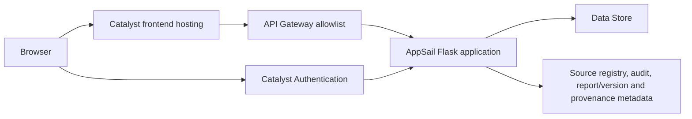

# HISTORICAL DESIGN MATERIAL — NOT FINAL DEPLOYMENT INSTRUCTIONS

# Catalyst Deployment Topology — Offline Manifest

Status: **D-12A offline preparation only**. Nothing in this document creates, inspects, authenticates to, or deploys a Catalyst resource.

## Selected service set

| Service | Decision | D-12A state |
|---|---|---|
| AppSail | Required backend hosting candidate | Configuration syntax and health behavior require live validation. |
| Data Store | Required canonical FIR persistence candidate | Schema, joins, constraints, pagination, and transaction behavior unverified. |
| Catalyst Authentication | Required only after user-mapping validation | Not enabled; prototype auth remains authoritative locally. |
| API Gateway | Required only after allowlist validation | Not created. |
| Web Client Hosting | Preferred frontend hosting candidate | Not created. |
| Flask-served Vite build | Lowest-risk fallback | Already supported by the local production path; no Catalyst action performed. |
| Stratus / SmartBrowz | Optional future artifacts/HTML-to-PDF work | Not required for submission; not integrated. |
| QuickML, Zia, NoSQL, Cache, OCR, face/voice, external AI | Excluded | Not required. |

## Intended topology

The frontend never queries Data Store directly. The Flask application remains the policy, source-selection, jurisdiction, masking, audit, and response-shaping boundary.

## Deployment order and reversible rollback order

Create and seed only after explicit live authorization in the exact `seed_order` in `deploy/catalyst/datastore-manifest.json`: schema/source metadata; organisation references; users; cases; people/legal/operational records; evidence/edges; assurance; investigations; reports; audit. Validate each batch before the next. Roll back in reverse logical dependency order, retaining safe logs and evidence of partial failure.

## Hosting choices

Preferred: Vite `dist` through approved Catalyst frontend hosting with an approved HTTPS origin and SPA fallback. Lowest-risk fallback: serve the existing built `frontend/dist` through the Flask AppSail unit, avoiding an extra cross-origin deployment. Choose only after browser origin, gateway CORS, static fallback, and health behavior are sandbox-validated.

## Authentication transition

Catalyst Authentication must map a provider subject to an existing canonical user. Backend lookup remains authoritative for Investigator, Crime Analyst, Supervisor, assigned station/district, jurisdiction, active/revoked state, purpose, and source permissions. Missing/inactive mappings fail closed. No open registration, password reset, demo-password migration, or client-supplied-role trust is planned.

## API Gateway allowlist plan

Allow only authenticated routes required for session, investigations, source control, FIR Search, Case 360, Related Cases, FIR Relationship Graph, Record Assurance, reports/reviews, and authorised audit. Public health remains minimal and safe; detailed health stays authenticated. Gateway validation must set an approved HTTPS CORS origin, request-size limit, safe response headers, and route-specific rate limits. Import/bootstrap/debug/legacy administrative routes remain unavailable unless separately authorised.

## AppSail readiness

This historical document no longer supplies an AppSail template. For the final route, use `docs/CATALYST_CUSTOM_RUNTIME_DEPLOYMENT.md` and `tools/deploy_catalyst_appsail.ps1`. The current local backend binds Flask using a platform-provided port, exposes `/api/health`, builds frontend assets before the single-unit option, treats the filesystem as temporary, and logs no secrets/payloads/raw exceptions.
