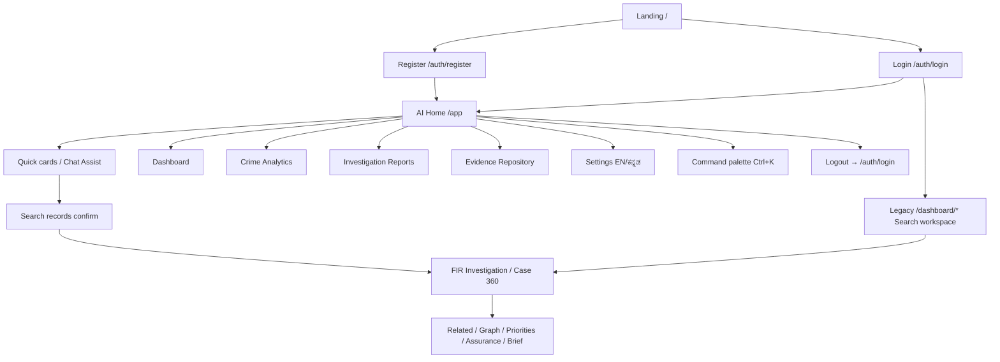

# ANVAYA NEXUS — Full App Workflow Record

**Live URL:** https://appsail-50044124045.development.catalystappsail.in/  
**Recorded:** 2026-07-26  
**Health at record time:** `status: ok`, `database: ok`, AI + voice services reachable  

Artifacts (screenshots + WebM videos) are under `/opt/cursor/artifacts/workflow-record/` on the cloud agent that produced this run. Re-run with:

```bash
node scripts/record-app-workflows.mjs
node scripts/record-investigation-journey.mjs
```

---

## Invented user persona

| Field | Value |
| --- | --- |
| Officer ID | `KSP/MYS/INV/7731` |
| Full name | Ananya Krishnamurthy |
| Role | Investigating Officer (`INVESTIGATOR`) |
| Station | Nazarbad PS |
| District | Mysuru |
| Password | `NexusWalkthru2026!` (synthetic demo only) |

**User idea:** Junior IO at Nazarbad PS starting a night shift. She needs to (1) clear unresolved chain-snatching FIRs, (2) open Case 360 and check related / graph / assurance views, (3) skim Crime Analytics and Evidence, (4) ask Chat Assist for a PDF dossier, then log out.

Registration succeeded on the live AppSail instance; subsequent logins use the same Officer ID.

---

## End-to-end workflow map



---

## Workflow 1 — Public entry & language

1. Open `/` — KSP / ANVAYA public landing.
2. Toggle **ಕನ್ನಡ | English** on the landing chrome.
3. Enter portal via **ANVAYA Portal** → `/auth/login`.

**Captured:** `01-landing.png`, `02-landing-kannada.png`, `03-login.png`

---

## Workflow 2 — Officer registration (invented persona)

1. From login info bar or form, open `/auth/register`.
2. Fill Government Officer ID, full name, role (Investigating Officer), password (+ confirm), station, district.
3. Click **Register & Sign In**.
4. App creates session and lands on `/app` (AI Home). Sidebar shows `KSP/MYS/INV/7731 · INVESTIGATOR`.

**Captured:** `04-register-empty.png`, `05-register-filled.png`, `06-register-success.png`

---

## Workflow 3 — Sign-in (returning officer)

1. `/auth/login` → Officer ID + password → **Sign In**.
2. Demo credentials also printed on the page (`investigator.demo` / `ANVAYA-DEMO-ONLY-2026`) but were not required after persona registration.
3. Lands on **AI Chat** home with model badges (Gemini / Sarvam), language switcher, bookmarks, Ctrl+K search.

**Captured:** `27-logout.png` (return to login), journey `01-home.png`

---

## Workflow 4 — AI Chat investigation (primary path)

Surface: `/app` (also `/app/home`, `/app/chat/:id`, `/app/search`)

1. **Empty state** — “Karnataka State Police AI Copilot” with quick pills: FIR Search, Case 360, Graph Analysis, AI Copilot, Dossier PDF, Voice Input.
2. **Suggested cards** — e.g. Pending Investigations (“unresolved chain snatching”), Case Summary (`SYN-FIR-1034`), Crime Trends, Shift Briefing, Network Connections, Vehicle FIR search.
3. Click **Pending Investigations** → AI interprets query.
4. Confirm with **Search records** (fail-closed: no interpreted search without explicit confirm).
5. Open case → **FIR Investigation View** (`SYN-CRIME-00001` / `SYN-CASE-NO-00001`) with Record Assurance warnings (synthetic defects).
6. Switch investigation tabs:
   - Related cases
   - Relationship graph (e.g. `CASE_SHARES_ACCUSED_WITH_CASE` links from `SYN-CASE-0001`)
   - Verification priorities
   - Record assurance
   - Grounded brief
7. Ask composer: `Open case SYN-CASE-0001` or `send me PDF` (preview/dossier path; human review required).
8. Voice (mic) and file attach (paperclip) available on composer; multilingual placeholder EN / ಕನ್ನಡ / हिन्दी.

**Captured:** journey `02`–`12`, full run `07`–`09`

---

## Workflow 5 — Dashboard (shift overview)

Surface: `/app/dashboard`

- KPI strip: Total FIR Records, Pending Investigations, Resolved Cases, Priority Actions (synthetic counts).
- Quick tiles to AI Chat, Analytics, Reports, Evidence.
- Recent Cases / Top Offence Types (may be empty until investigations are run).
- Synthetic-data banner.

**Captured:** `10-dashboard.png`

---

## Workflow 6 — Crime Analytics

Surface: `/app/analytics`

- Crime Trends card (descriptive week bars; “Live”).
- Shift Briefing card (AI-assisted overview prompts).
- Data source status: CCTNS Replica, Forensics DB, Vehicle Registry, Context Records.
- Deep trend/brief content often continues via AI Chat phrases (“Show recorded crime trends”, “Show my shift briefing”).

**Captured:** `11-analytics.png`

---

## Workflow 7 — Investigation Reports

Surface: `/app/reports`

- Report console for dossiers / briefs / PDF export paths.
- Complements Case 360 **Prepare brief** / grounded brief / “send me PDF” chat phrases.

**Captured:** `12-reports.png`

---

## Workflow 8 — Evidence Repository

Surface: `/app/evidence`

- Station-scoped list (Nazarbad PS for this persona).
- Counts: Total / Verified / Pending / In Custody.
- Type filters: Document, Physical Exhibit, Forensic Report, Digital Evidence, Photography.
- Rows with FIR refs (e.g. `SYN-FIR-1034`), View + Download actions, chain-of-custody status.

**Captured:** `13-evidence.png`, journey `18-module-evidence.png`

---

## Workflow 9 — Settings & locale

Surface: `/app/settings`

- Preferences, language (English / ಕನ್ನಡ), and related chrome.
- TopBar language toggle also switches portal chrome without leaving the current module.
- Dark mode toggle in sidebar.

**Captured:** `14-settings.png`, `17-settings-kannada.png`

---

## Workflow 10 — Supervisor panel (role-gated)

Surface: `/app/supervisor`

- Present in router/command palette.
- Sidebar **Supervisor** nav only when `user.role === 'SUPERVISOR'`.
- Persona is `INVESTIGATOR`, so this surface is reachable by URL but not promoted in sidebar.

**Captured:** `15-supervisor.png`

---

## Workflow 11 — Command palette & utilities

- **Ctrl+K** / TopBar search opens command palette (New Chat, Dashboard, Analytics, Reports, Evidence, Supervisor, Settings).
- **Ctrl+N** starts a new chat (`/app`).
- Bookmarks + Intel controls in TopBar.
- Model switcher: Gemini vs Sarvam AI Suite.

**Captured:** `19-command-palette.png`

---

## Workflow 12 — Legacy portal (AuthenticatedLayout)

Still routed for the form-first investigation pipeline:

| Path | Purpose |
| --- | --- |
| `/dashboard` | Legacy dashboard |
| `/dashboard/search` | Search & Case 360 — ASK → DISCOVER → VERIFY → PRIORITISE → REPORT |
| `/dashboard/workspace` | Investigation workspace |
| `/dashboard/analytics` | Legacy analytics |
| `/dashboard/reports` | Legacy reports |
| `/dashboard/health` | System health |
| `/dashboard/settings` | Legacy settings |
| `/dashboard/supervisor` | Legacy supervisor |
| `/dashboard/cases/:id` | Case detail |

Form-first Search steps observed live:

1. Optional **Try demo query**.
2. Question e.g. “Find unresolved chain snatching cases” + offence chips (Chain snatching, Housebreaking, Vehicle theft, Robbery).
3. STEP 2 scope filters: Offence / Status / Location-station; purpose “Active Case Investigation”.
4. **Preview query** or **Search records** → DISCOVER results → **Open Case 360** drawer (Related / Graph / Network / Priorities / Prepare brief).

**Captured:** `20`–`26` full run; journey `13`–`14`

---

## Workflow 13 — Logout

1. TopBar or sidebar **Logout**.
2. Session cleared → `/auth/login`.

**Captured:** `27-logout.png`, journey `20-logged-out.png`

---

## Route inventory (authenticated AppShell)

| Route | Module |
| --- | --- |
| `/app`, `/app/home`, `/app/chat/:id`, `/app/search` | AI Chat / Home |
| `/app/dashboard` | Dashboard |
| `/app/analytics` | Crime Analytics |
| `/app/reports` | Investigation Reports |
| `/app/evidence` | Evidence Repository |
| `/app/settings` | Settings |
| `/app/supervisor` | Supervisor (role-aware) |
| `/app/cases/:id` | Case detail view |
| `/app/workspace/:id` | Investigation workspace view |
| `/onboarding` | Onboarding (AuthGuard) |

Public: `/`, `/auth/login`, `/auth/register`. Aliases redirect into `/app/*` or `/auth/*`.

---

## Guardrails observed in product copy

- Synthetic data only — not live KSP / CCTNS.
- Human review required for AI insights and operational decisions.
- Fail-closed search confirmation (**Search records**).
- Record assurance flags staged/missing synthetic fields.
- No guilt / person-risk forecasting claims in chrome.

---

## Recording files

| Artifact | Location |
| --- | --- |
| Full surface walkthrough video | `/opt/cursor/artifacts/workflow-record/anvaya-full-workflow.webm` |
| Investigation journey video | `/opt/cursor/artifacts/workflow-record/anvaya-investigation-journey.webm` |
| Step screenshots (full) | `/opt/cursor/artifacts/workflow-record/screens/` |
| Step screenshots (journey) | `/opt/cursor/artifacts/workflow-record/screens-journey/` |
| Machine logs | `workflow-log.json`, `journey-log.json` (this folder) |
| Recorders | `scripts/record-app-workflows.mjs`, `scripts/record-investigation-journey.mjs` |
